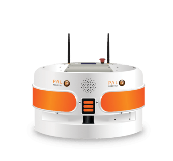
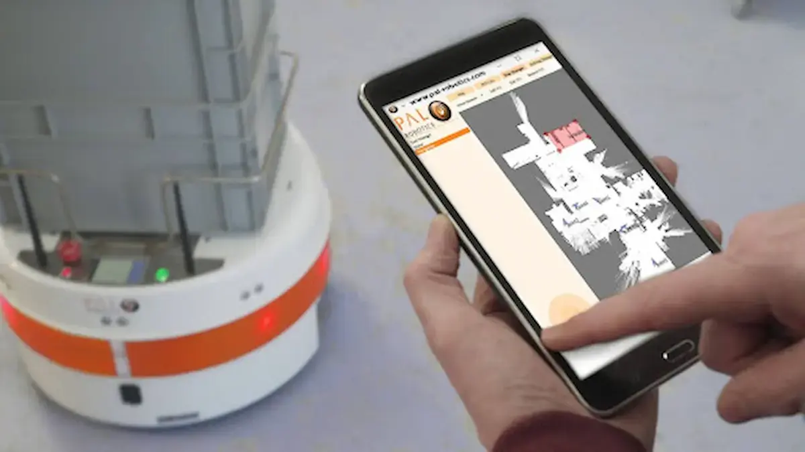
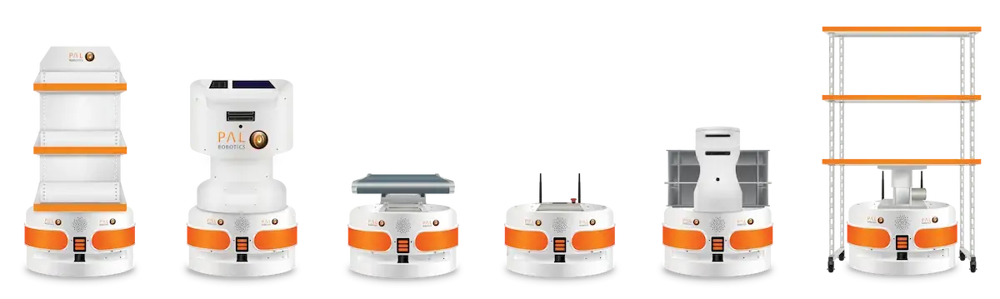
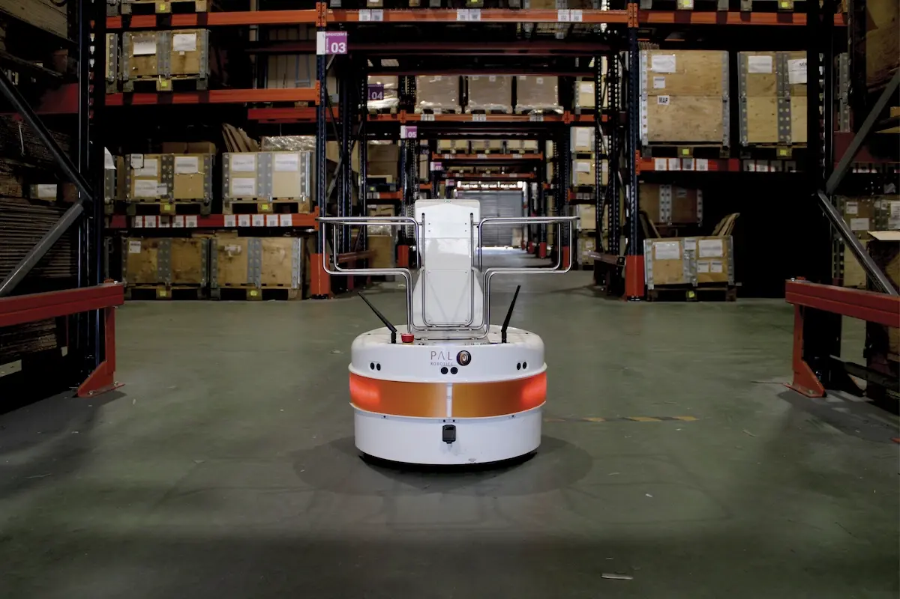
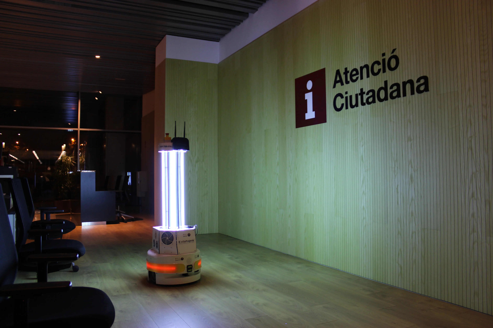
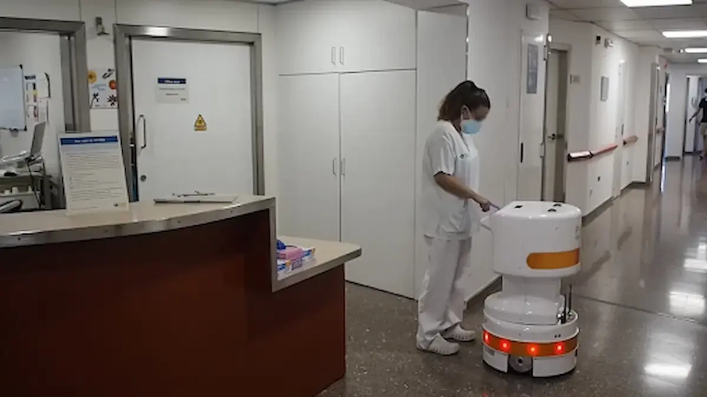

# TIAGo Base (or PMB2)

TIAGo Base is a compact Autonomous Mobile Robot (AMR) designed for quick setup, efficient management, and fleet coordination, offering a high degree of customization to meet specific requirements.

## Key Features:

- Efficient and highly maneuverable movement
- Advanced navigation and obstacle avoidance
- Accessory customization
- High payload capacity
- Integration with any external system via REST API
- Runs on Ubuntu LTS 64-bit and ROS LTS/ROS 2 LTS
- User-friendly Web User Interface
- Fleet management control
- Advanced autonomous navigation capabilities, including obstacle avoidance
- Map Editor (rviz plugin) for defining points and regions of interest, virtual obstacles, and preferred navigation paths (highways)
- Multiple maps management
- Compatible with tablets, computers, and mobile devices

## Technical Specifications:

- **Operating System:** Ubuntu LTS 64-bit
- **Robot Operating System (ROS):** ROS LTS/ROS 2 LTS
- **Software Packages:** Set of integrated software packages

TIAGo Base provides a comprehensive solution for various robotic applications, combining advanced capabilities with ease of use and customization flexibility.

## Tutorials and Integrations

### Tutorials with Gazebo Dynamic Simulator
Tutorials are available for TIAGo Base with the Gazebo dynamic simulator, including creating a map with gmapping, localization, and path planning. 

[Watch the tutorials here](https://www.youtube.com/watch?v=P4nvZbgCkL0)

### Additional Logistic Task Planner
The additional logistic task planner software package is available for purchase with the base. This package allows for task reallocation and notification to the warehouse manager in case of constraints such as priority, battery, task duration, and robot failure.

### Compatible Integrations

TIAGo Base is designed to be compatible with a wide range of possible integrations:

- **TIAGo Delivery**: Equipped with a safety box, TIAGo Delivery is designed for food or medication deliveries in hospitals and hotels. It makes deliveries quickly and safely, reducing the need for social interactions and minimizing the spread of infection. Tasks can be easily changed on the go.
  
- **TIAGo Actuated Conveyor**: This solution features a roller conveyor, perfect for easy loading of boxes of objects such as deliveries, supplies, medication, or food. It automates the loading, unloading, and transportation of goods within the site.
  
- **TIAGo Static Roller**: With a fixed conveyor, TIAGo Static Roller automates the transportation of goods in any indoor environment.
  
- **TIAGo Shelf**: Equipped with an adjustable shelf and vision add-on with 2x depth cameras, TIAGo Shelf increases safety and improves obstacle avoidance.
  
- **TIAGo Stackable Boxes**: This solution is designed for stacking boxes for the delivery of a large number of objects, ideal for businesses, hospitals, and factories. It is suitable for delivering mail, factory goods, food, medication, and medical supplies.

## Applications

### Agile Manufacturing

- Fast ROI
- Off-the-shelf applications and customizations
- Easy deployment and flexible task modification
- Navigation in constrained environments
- Collaboration with robots and humans

### Healthcare and Ambient Assisted Living (AAL)

- Improved quality of service
- Reduced walking time for personnel
- Prevention of equipment shortages
- Cost savings and manageable staff requirements
- Safe transportation and storage of toxic, hazardous, or corrosive materials

### Retail / Store Delivery and Service Industry

- Efficient and accurate inventory management
- Task optimization
- Real-time data collection for informed decision-making
- Scalability and flexibility in retail operations
- Brand differentiation and innovation

## Use Cases

### TIAGo Base at Mapcable

TIAGo Base collaborates with Mapcable, a Catalan electrical wiring company under Fundació MAP. Fundació MAP operates CETMAP, a Special Employment Centre where people with disabilities engage in various productive activities. Mapcable specializes in electrical wiring, industrial assemblies, bagging, and packaging.

**TIAGo Base Use Case at Mapcable:**
TIAGo Base aids Mapcable workers with intralogistics tasks, facilitating indoor deliveries. The robot transports stackable boxes around the center, supporting team members and improving intralogistics workflow. This reduces bottlenecks, eases physical strain on workers, and enhances productivity.

[Read more about TIAGo Base at Mapcable](https://blog.pal-robotics.com/tiago-base-at-mapcable/) [[Video]](https://www.youtube.com/watch?v=WKk1bwsR2a0)

### TIAGo Base Disinfection at Generalitat de Catalunya

TIAGo Disinfection is a mobile robot equipped with germicidal ultraviolet lights for autonomous disinfection. Tested at the Administrative District of the Generalitat de Catalunya, the robot ensures thorough space disinfection.

**Advantages of TIAGo Disinfection:**
- Faster and more frequent disinfection compared to traditional methods
- Access to contaminated areas without risking personnel safety
- Remote task management via a user-friendly application
- Quick and easy implementation without technical expertise or environmental impact

[Learn more about TIAGo Disinfection](https://blog.pal-robotics.com/tiago-disinfection-tested-at-generalitat/) [[Video]](https://www.youtube.com/watch?v=TD0ObXbpmCQ)

### TIAGo Base Delivery and Conveyor in the Hospitals

As part of the DIH-HERO project, TIAGo Delivery and TIAGo Conveyor robots were deployed in hospitals such as the Hospital Municipal of Badalona and Hospital Clínic Barcelona.

**Deployment Use Cases:**
- Transportation of food trays to patient rooms, reducing personal contacts, and aiding isolated patients
- Transportation of sensitive goods like medication and medical supplies with enhanced security measures

[Explore TIAGo Delivery and Conveyor in hospitals](https://blog.pal-robotics.com/tiago-delivery-impact-hospitals-covid19/) [[Video]](https://www.youtube.com/watch?v=o8vujaDJXcY)

## Research and Publications

For those interested in the academic research and advancements related to TIAGo Base, please have a look at the following list of academic publications updated to September 2023.

- [Leon Žlajpah, Tadej Petrič (2023): Kinematic calibration for collaborative robots on a mobile platform using motion capture system](https://www.sciencedirect.com/science/article/pii/S0736584522001296)
- [Pablo Lanillos, Daniel Burghardt (2022): Robot Localization and Navigation Through Predictive Processing Using LiDAR](https://link.springer.com/chapter/10.1007/978-3-030-93736-2_61)
- [Amandyk Tuleshov, Nutpulla Jamalov, Nurbibi Imanbayeva, Ayaulym Rakhmatulina (2022): Design and Construction of a Multifunctional Disinfection Robot](https://papers.ssrn.com/sol3/papers.cfm?abstract_id=4060408)
- [Lakshadeep Naik, Thorbjørn Mosekjær Iversen, Aljaz Kramberger, Jakob Wilm, Norbert Krüger (2022): Multi-view object pose distribution tracking for pre-grasp planning on mobile robots](https://findresearcher.sdu.dk/ws/portalfiles/portal/201890715/Multi_view_pose_distribution_tracking_ICRA2022_camera_ready.pdf)
- [Philipp Schillinger, Sergio García, Alexandros Makrisc, Konstantinos Roditakisc, Michalis Logothetis, Konstantinos Alevizos, Wei Rene, Pouria Tajvare, Patrizio Pelliccione , Antonis Argyros, Kostas J.Kyriakopoulos, Dimos V. Dimarogonase (2021): Adaptive heterogeneous multi-robot collaboration from formal task specifications](http://dx.doi.org/10.1016/j.robot.2021.103866)
- [Daniel Kiryanov, Roman Lavrenov, Ramil Safin, Mikhail Svinin, Evgeni Magid (2021): Mobile application for controlling multiple robots](https://ieeexplore.ieee.org/abstract/document/9516091)
- [Ruslan Safin, Roman Lavrenov, Tatiana Tsoy, Evgeni Magid, Mikhail Svinin, Sumantra Dutta Roy, Subir Kumar Saha (2021): Prioritizing Tasks Within a Robotic Transportation System for a Smart Hospital Environment](https://link.springer.com/chapter/10.1007/978-3-030-87725-5_16)
- [Frédéric Guinand, François Guérin, Étienne Petitprez (2021): UAV-UGV Multi-robot System for Warehouse Inventory: Scheduling Issues](https://www.researchgate.net/publication/354932654_UAV-UGV_Multi-robot_System_for_Warehouse_Inventory_Scheduling_Issues)
- [Valeria Seidita, Francesco Lanza, Arianna Pipitone, Antonio Chella (2021): Robots as intelligent assistants to face COVID-19 pandemic](https://academic.oup.com/bib/article/22/2/823/6039451)
- [Clara Palacios Marín, Marina Vallés Miquel (2021): Estudio de la Aplicabilidad del Transporte Automatizado para el Transporte de Material en Hospitales](https://riunet.upv.es/handle/10251/173302)
- [Jude Gyimah (2021): Variability Management in Robotic Systems: A Variability-Modelling Language That Implements Variation Points Based On Binding Time and Binding Mode](https://gupea.ub.gu.se/bitstream/handle/2077/70517/gupea_2077_70517_1.pdf?sequence=1&isAllowed=y)
- [Elvira Chebotareva, Evgeni Magid, Alexander Carballo, Kuo-Hsien Hsia (2020): Basic User Interaction Features for Human-Following Cargo Robot TIAGo Base](https://ieeexplore.ieee.org/abstract/document/9450794)
- [Artur Khazetdinov, Andrey Aleksandrov, Aufar Zakiev, Evgeni Magid (2020): RFID-based Warehouse Management System Prototyping Using a Heterogeneous Team of Robots](https://www.researchgate.net/profile/Manuel-Silva-8/publication/343714348_Robots_in_Human_Life_-_CLAWAR'2020_Proceedings/links/5f3bba98299bf13404cd6c30/Robots-in-Human-Life-CLAWAR2020-Proceedings.pdf#page=279)
- [Elvira Chebotareva, Ramil Safin, Kuo-Hsien Hsia, AlexanderCarballo, Evgeni Magid (2020): Person-Following Algorithm Based on Laser Range Finder and Monocular Camera Data Fusion for a Wheeled Autonomous Mobile Robot](https://link.springer.com/chapter/10.1007/978-3-030-60337-3_3)
- [Eldar Mingachev, Roman Lavrenov, Tatyana Tsoy, Fumitoshi Matsuno (2020): Comparison of ROS-Based Monocular Visual SLAM Methods: DSO, LDSO, ORB-SLAM2 and DynaSLAM](https://www.researchgate.net/publication/344488567_Comparison_of_ROS-Based_Monocular_Visual_SLAM_Methods_DSO_LDSO_ORB-SLAM2_and_DynaSLAM)
- [Pablo Buenestado Caballero (2020): Estudio de la implantación de AGVs en el entorno industrial](https://upcommons.upc.edu/handle/2117/336982)
- [Cristian Matas Hidalgo, Carlos Ocampo-Martínez (2020): Design and simulation of a laboratory with cobots: Collaborative laboratory design](https://upcommons.upc.edu/handle/2117/187856)
- [Jérémie Deray, Joan Solà, Juan Andrade-Cetto (2019): Joint on-manifold self-calibration of odometry model and sensor extrinsics using pre-integration](https://upcommons.upc.edu/bitstream/handle/2117/180773/2210-Joint-on-manifold-self-calibration-of-odometry-model-and-sensor-extrinsics-using-pre-integration.pdf;jsessionid=3E99A3FFA6C2258C524C97061AEDBFF9?sequence=1)
- [Jérémie Deray, Joan Solà, Juan Andrade-Cetto (2019): Robust navigation for industrial service robots](https://upcommons.upc.edu/bitstream/handle/2117/331092/TJD1de1.pdf?sequence=1&isAllowed=y)